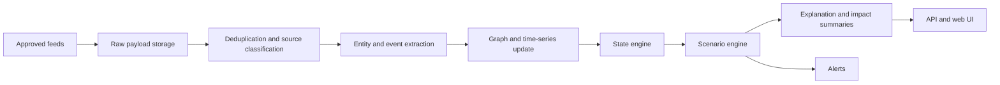

# Architecture Overview

## System Layers

1. Ingestion layer
2. Normalization and extraction layer
3. Knowledge graph and storage layer
4. State and scenario engine
5. Explanation and impact layer
6. Web application and analyst workflow layer

## Recommended Stack

- Frontend: Next.js, TypeScript, Tailwind CSS
- Backend: FastAPI, Python
- Jobs: Celery or Temporal
- Storage: Postgres, TimescaleDB, graph database, Redis
- Infra: Docker first, Kubernetes later if scale requires

## Data Flow

## Key Constraint

Every derived insight must be traceable back to stored evidence and source metadata.

